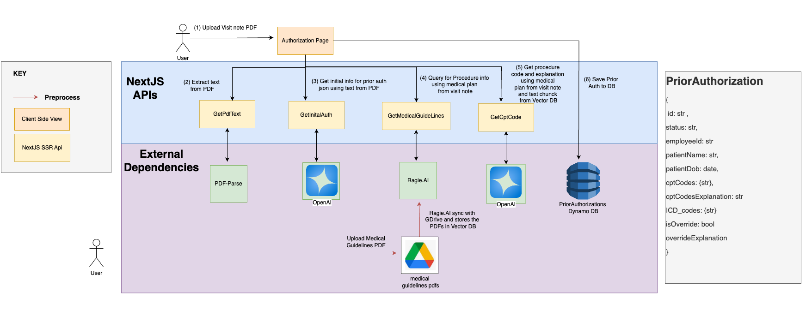

# Prior Authorization System

A modern web application for managing healthcare prior authorizations efficiently.

## Overview

This application streamlines the prior authorization process by providing a centralized platform for managing patient authorizations, code validations, and status tracking.

## Features

- Patient information management
- ICD and CPT code validation
- Authorization status tracking
- Override capabilities with documentation

## Tech Stack

- Next.js 13+ with TypeScript
- Shadcn/ui
- DynamoDB
- OpenAI
- Ragie.AI
- AWS Lambda

## Getting Started
1. Visit URL: https://development-v4.d3v68ywpyu0w2i.amplifyapp.com
2. Login with credentials:
    - Username: any string value
    - Password: any string value 

3. Use dummy visit notes in test folder to uplaod

## Features

- Create new authorization request
- View all authorization requests
- Edit authorization requests
- Cancel authorization requests

